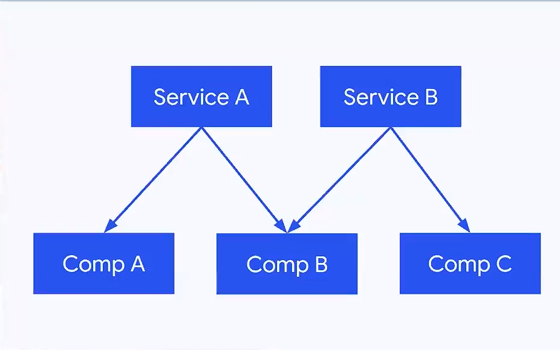

=======
Angular
=======

.. image:: https://angular.io/assets/images/logos/angular/angular.svg
    :width: 400px
    :alt: Logo Angular
    :align: center

.. contents:: Table de contenidos de la pagina
   :depth: 2
   :local:

Que es Angular y porque elegirlo? 
##################################

Angular mas que un framework se considera toda una plataforma, con módulos y paquetes listo para utilizar en una aplicación.

* Forms
* PWA
* Language Services
* Router
* Elements
* CDK
* Universal
* Compiler
* i18n
* Http
* Material
* CLI

Angular se reconocer por tener un gran rendimiento en las aplicaciones. 
También podemos tener aplicaciones multiplataforma (llevándolas a electron, native script, ionic)
Ademas angular tiene una gran comunidad.

Instalación
############

Instalar Node
*************

Para empezar a trabajar con Angular necesitamos tener instalado **Node.js** para ellos podemos ir a `la pagina de node <https://nodejs.org/>`_.
Lo mas recomendable es instalar la ultima version LTS (Long Term Support)

También si necesitamos una version particular podemos instalar una version particular utilizando el software para manejo de versiones **nvm**.

* `Version para Windows <https://github.com/coreybutler/nvm-windows>`_ 
* `Version para linux/mac/WSL <https://github.com/nvm-sh/nvm>`_ 

Luego con el siguiente comando podemos ver que version de node tenemos:

.. code-block:: console

    node -v

También con el siguiente comando podemos ver que version de npm (instalador de paquetes de node) tenemos:

.. code-block:: console

    npm -v

Instalación de angular
***********************

Para instalar el framework de angular tenemos que hacer uso del siguiente comando: 

.. code-block:: console

   npm i -g @angular/cli

.. note::
   Este comando nos instala la ultima version del framework disponible. Si queremos una version en particular podemos utilizar el mismo comando agregando un **@** para especificar la version. **Ejemplo: npm i -g @angular/cli@12.1.2**

Para verificar la version del CLI que tenemos instalada ejecutamos el siguiente comando:

.. code-block:: console

   ng version

Crear una aplicación
#####################

Para crear una aplicación vamos al directorio donde se va a generar la estructura de directorios de angular y usamos el siguiente comando:

.. code-block:: console

   ng new my-project

.. note::
   Especificamos que nuestra aplicación tenga **routing** y elegimos el preprocesador que utilicemos, el mas común es **SCSS**
   Automáticamente angular nos alista un proyecto listo para trabajar.

Luego entramos a la carpeta de nuestro proyecto y ejecutamos el siguiente comando:

.. code-block:: console

   ng serve -o

.. note::
   * Este comando nos genera un servidor de desarrollo en localhost en el puerto 4200 por defecto.
   * La opción -o nos permite abrir el servidor de desarrollo directamente en nuestro navegador predeterminado.
   * La opción --port=3500 nos permite abrir el servidor de desarrollo pero en el puerto 3500.
   * Para matar el proceso de la terminal podemos usar el comando **ctrl + c**.

Si volvemos a Ejecutar el comando ng version dentro de la carpeta de nuestro proyecto obtenemos la información de que dependencia y versiones tiene nuestro proyecto

Estructura de un proyecto en Angular
####################################

+---------------------+-------------------------------------------------------------------------------------------------------------------------------------------+
| Archivo/ Directorio | Descripción                                                                                                                               |
+=====================+===========================================================================================================================================+
| src/                | Aquí Esta el corazón de la aplicación (Componentes, html, css, routing)                                                                   |
+---------------------+-------------------------------------------------------------------------------------------------------------------------------------------+
| .browserslistrc     | En que versiones del navegador tiene que ser compatibles la aplicación                                                                    |
+---------------------+-------------------------------------------------------------------------------------------------------------------------------------------+
| .editorconfig       | Para escribir reglas de escritores de trabajo en equipo (Plugin editor config)                                                            |
+---------------------+-------------------------------------------------------------------------------------------------------------------------------------------+
| tsconfig.json       | Configuración de que tiene angular con typescript. Compilación, versiones de typScript, donde transpile los archivos                      |
+---------------------+-------------------------------------------------------------------------------------------------------------------------------------------+
| angular.json        | Se puede manejar diferentes ambientes (Staging, QA, Production) También configuraciones de compilación, tamaños de la aplicación, etc     |
+---------------------+-------------------------------------------------------------------------------------------------------------------------------------------+
| karma.conf.json     | Configuración para correr pruebas unitarias.                                                                                              |
+---------------------+-------------------------------------------------------------------------------------------------------------------------------------------+
| package.json        | Aquí tenemos los scripts, las versiones que estamos manejando                                                                             |
+---------------------+-------------------------------------------------------------------------------------------------------------------------------------------+
| .nvm                | Este archivo deberíamos añadir para especificar la version de node que estamos utilizando                                                 |
+---------------------+-------------------------------------------------------------------------------------------------------------------------------------------+

Para mejorar la experiencia de desarrollo hay una extension para vscode y otros editores de código llamada `Angular Language Service <https://marketplace.visualstudio.com/items?itemName=Angular.ng-template>`_. 

Conceptos básicos de typescript
################################

TypeScript puede inferir tipos como por ejemplo:

.. code-block:: typescript

   const userName = 'Hola Mundo'

Pero con Typescript puedo asegurarme el tipado de la variable para asegurarme:

.. code-block:: typescript

   const userName: string = 'Hola Mundo'

.. note::
   * Esto evitaría cometer errores de querer agregar a la variable **userName** el valor 1 por ejemplo.
   * El tipado puede corregir hasta el 60% de 🐛bugs que cometemos como desarrolladores. 

También es posible indicar que una variable es de 2 tipos

.. code-block:: typescript

   const userName: string | number = 'Hola Mundo'

También se puede proteger a las funciones con un tipado. Lo cual nos da un feedback temprano de que tipos de valores espera la función: 

.. code-block:: typescript

   const sum = (a: number, b: number) => {
       return a + b
   }

Ademas nos permite crear clases de una manera mas simple pasando de esto:

.. code-block:: typescript

   class Person{
       age: number
       lastName: string

       constructor(age: number, lastName: string){
           this.age = age
           this.lastName = lastName
       } 
   }

   const nico = new Person(28, 'Mendoza')

A esto:

.. code-block:: typescript

   class Person{
       constructor(public age: number, public lastName: string){}
   }

   const nico = new Person(28, 'Mendoza')

Comunicación de datos en Angular
#################################

String Interpolation
********************

Es la forma que nosotros desde nuestra lógica escrita en TypeScript podemos pasar datos a la renderizar a nuestro template. 
Es la forma en que nosotros con doble llaves podemos poner una expresión dentro de ella como una función o una variable que este en TypeScript.

Por ejemplo:

.. code-block:: typescript
   :caption: Código TypeScript

   export class AppComponent {
       name = 'Nicolás'
       age = 18
       url = 'https://angular.io/assets/images/logos/angular/angular.svg'
   }

.. warning::
   Para poder renderizar las variables del TypeScript de nuestro componente tienen que ser de acceso publico 🔓 

.. code-block:: html
   :caption: Código HTML

   <h2>{{ 'Hola Mundo '.repeat(5) }}</h2>   
   
 3 + 3 =  {{ 3 + 3 }} 

   <h3>Hola soy {{ name }} y tengo {{ age }} años</h3>
   

Property Binding
****************

Es la forma en la que podemos modificar atributos desde el controlador, y mandar a los atributos en el HTML.
Por ejemplo: El tag de una imagen, el href de un link, el estado de un botón

.. code-block:: typescript
   :caption: Código TypeScript

   export class AppComponent {
       name = 'Nicolás'
       age = 18
       url = 'https://angular.io/assets/images/logos/angular/angular.svg'
       btnDisabled = true
   }

.. code-block:: html+ng2
   :caption: Código HTML

   <button [disabled]="btnDisabled"> Enviar </button>
   <input type="text" [value]="name" />
   <progress max="100" [value]="age"></progress>
   

.. note::
   El string interpolation nos sirve mas para ingresar contenido como en párrafos, h1, h2, etc.
   El Property Binding son específicamente para propiedades. Es recomendable para valores que no son un string.

Event Binding
*************

Sirve para ejecutar una función que definamos en el componente desde el template.
El evento que queremos capturar esta encerrado entre paréntesis.

.. code-block:: typescript
   :caption: Código TypeScript

   export class AppComponent {
       btnDisabled = true

       toggleButton(){
           this.btnDisabled = ! this.btnDisabled 
       }

       onScroll(event: Event){
           const element = event.target as HTMLElement
           console.log(element.strollTop)
       }

       changeName(event: Event){
           const element = event.target as HTMLInputElement
           this.name = element.value
       }
   }

.. code-block:: scss
   :caption: Código SCSS

   .box{
       height: 200px;
       width: 200px;
       overflow: auto;
       background: red;
   }

.. code-block:: html+ng2
   :caption: Código HTML

   <button [disabled]="btnDisabled"> Enviar </button>
   <button (click)="toggleButton()"> Toggle Button</button>

   

    
Lorem..

   

   <input type="text" [value]="name" (keyup)=changeName($event) />
   
Nombre: {{ name }}

.. note::
   Los eventos que son nativos del html o DOM los enviamos con **$event**

Data Binging
************

Es una fusion entre escuchar un evento con ``Event Binding`` y ``setear una propiedad`` (En angular utilizamos el ``NgModel``)

Sirve mucho para los input, siempre esta pendiente del estado del input, si el campo es valido o no y sincroniza el valor.

También Nos permite saber si una propiedad es valida utilizando un **#template** 

.. code-block:: typescript
   :caption: Código TypeScript
   
   export class AppComponent {
       name = 'Nicolás'
   }
   
.. code-block:: html+ng2
   :caption: Código HTML

   
Nombre {{ name }}

   <input type="text" required #nameInput="ngModel" [(ngModel)]="name" ></input>
   
Valid: {{ nameInput.valid }}

.. warning::
   Para poder habilitar el **NgModel** tenemos que ir a **app,.modules.ts**, importar el modulo **FormsModule** y colocar lo en el array de imports.

   .. code-block:: typescript
      :caption: Código TypeScript
   
      import { FromsModules } from '@angular/forms'

      @NgModule({
        declarations: [
            AppComponent
        ],
        imports: [
            BrowserModule,
            AppRoutingModule,
            FromsModules
        ],
        providers: [],
        bootstrap: [AppComponent]
      })
   
Estructuras de control en Angular
#################################

ngIf
*****

Tenemos la directiva **ngIf** la cual, si se cumple la condición booleana del contenido, se renderiza el elemento html.

.. code-block:: html+ng2
   :caption: Código HTML

   

También se puede utilizar else en la condición:

.. code-block:: html+ng2
   :caption: Código HTML

   

   <ng-template #myBlock>
    
Bloque de else

   </ng-template>

ngFor
*****

La directiva **ngFor** la cual nos sirve para iterar un array. También nos permite utilizar el indice o posición de cada elemento del array.

.. code-block:: typescript
   :caption: Código TypeScript
   
   export class AppComponent {
       names: string[] = ['Nicolás', 'Julian', 'Santiago']
   }

.. code-block:: html+ng2
   :caption: Código HTML

   <ul>
    <li *ngFor="let name of names; index as i">
        {{ i }} {{ name }}
    </li>
   </ul>

   <ng-template #myBlock>
    
Bloque de else

   </ng-template>

.. note::
   No se pueden iterar objetos, solo se iteran arrays. Si queremos iterar arrays de objetos podemos definir interfaces.

ngSwitch
********

Esta directiva nos sirve para no tener que hacer tantas cadenas de ngIf.
Se escribe como un Data Binding y cada case como una estructura de control.

.. code-block:: html+ng2
   :caption: Código HTML

   

    
La persona es Nicolas

    
La person a es Julian

    
La person a es Camilo

    
No hace match

   

Estilos en Angular
##################

En angular tenemos un archivo con extension **.scss** donde podemos poner nuestros estilos y utilizarlos en el componente que necesitemos.

.. code-block:: 
   :caption: Código SCSS

   .products--grid {
       display: flex;
       flex-direction: column;
       div {
           img {
               width: 100%;
               border-radius: 10px;
           }
           h2, p{
               margin: 0;
           }
       }
   }

   @media screen and (min-width: 40em){
       products--grid{
            display: grid;
            grid-template-columns: repeat(5, 1fr);
            grid-gap: 15px;
       }
   }

.. code-block:: html+ng2
   :caption: Código HTML
   
   

    

        
        <h2>{{ product.price }}</h2>
        
{{ product.name }}

    

   

Dynamic class & Styles
**********************

Para hacer estilos dinámicos necesitamos poner la **Property Binding** class seguida de un punto y el nombre de la clase que queremos añadir si la condición se cumple ``[class.nombre_clase]="condition"``.

.. code-block:: scss
   :caption: Código SCSS

   .message-error {
       background: red;
       color: white;
       opacity: 0;
       transition: all linear .5s;
       &.invalid {
           opacity: 1:
       }

   }

.. code-block:: html+ng2
   :caption: Código HTML

   <input type="text" required #nameInput="ngModel" [(ngModel)]="name">

   
El campo es requerido

Si queremos modificar el estilo directamente de algo en particular, necesitamos poner una **Property Binding** style seguida de un punto y el nombre del estilo que queremos modificar seguida del valor que le queremos asignar, este puede contener una expresión ternaria ``[style.nombre_estilo]="valor_estilo"``. (Es un estilo inline)

.. code-block:: html+ng2
   :caption: Código HTML

   
texto texto texto

   
.. note::
   Si queremos modificar los estilos de una etiqueta html antes de definir el valor de la condición por ejemplo el valor de **ngModel** nos va a dar un error.

NgClass & NgStyle
*****************

**NgClass** sirve para agrupar todos los estilos dinámicos [class] de la siguiente manera:

.. code-block:: 
   :caption: Código HTML

   

**NgStyle** podemos agrupar todos los estilo en linea de la siguiente manera: 

.. code-block:: typescript
   :caption: Código TypeScript
   
   export class AppComponent {
       box = {
           name: 'Nicolás',
           height: 100,
           background: 'red'
       }
   }

.. code-block:: 
   :caption: Código HTML

   

Crear un Formulario
###################

Para crear un formulario en Angular utilizamos la directiva **ngForm**. Cuando se presione el botón de enviar formulario se invocara a la función asignada al **ngsubmit**.

.. code-block:: typescript
   :caption: Código TypeScript

   export class AppComponent {
       register = {
           name: '',
           email: '',
           password: ''
       }
   }

.. code-block:: html+ng2
   :caption: Código HTML

   <form  (ngSubmit)="onRegister()" #myForm="ngForm">
    

        <label for="name">Nombre</label>
        <input type="text" required id="name" name="name" [(ngModel)]="register.name">
        
Mensajes de Error

    

    

        <label for="email">Email</label>
        <input type="email" required id="email" name="email" [(ngModel)]="register.email">
        
Mensajes de Error

    

    

        <label for="password">Password</label>
        <input type="password" required id="password" name="password" [(ngModel)]="register.password">
        
Mensajes de Error

    

    <button [disabled]="myForm.invalid" type="submit" >Registrar</button>
   </form>
   
.. warning::
   A los botones dentro de formularios es necesario ponerles un type del tipo **button** para evitar que los tome del tipo **submit** y se envié el formulario de forma involuntaria.

Deployment con firebase
#######################

Los pasos para subir un proyecto en firebase son los siguientes

1. Ir a firebase.google.com 
2. Crear una cuenta de GMail y hacer LogIn
3. Ir a la consola de desarrollo
4. Seleccionar nuevo proyecto
5. Colocar el nombre de nuestro proyecto
6. Le podemos agregar google analytics
7. Seguimos en continuar
8. Seleccionamos build Hosting y le damos empezar
9. Seguir los 3 pasos que nos indica Firebase

.. code-block:: console

   npm install -g firebase-tools

.. code-block:: console

   firebase -V

.. code-block:: console

   firebase login
    

.. code-block:: console

   firebase init

* Si deseamos crear los archivos de firebase en el directorio actual
* Que servicios queremos utilizar --> hosting: configure files
* Queremos crear un proyecto o usar existente --> user an existing 
* Lista de nuestros proyectos --> el que creamos al inicio
* Que carpeta queremos publicar --> ponemos public por defecto
* Reescribir url para single page application --> yes
* Queremos habilitar deployment con github actions --> No
* Borramos el directorio public 
* Crea los archivos de firebase 

10. Compilar nuestro proyecto ng build --> crea directorio dist/nombre_proyecto
11. Cambiamos el parámetro public del archivo firebase.json por el directorio anterior
12. Ultimo paso de firebase ejecutar --> firebase deploy 
13. Listo nos devuelve la URL de nuestro proyecto

Componentes en Angular
######################

Es la parte mas importante y el bloque principal para desarrollar en Angular.
No es buena practica tener toda la lógica y la aplicación en un solo archivo.
Abstraemos toda la lógica en varios componentes con responsabilidades únicas y estilos apropiados

Los componentes en Angular tienen **4** archivos :

* La **Vista o template** html
* Los **estilos** css, scss o less
* Un archivo para hacer **pruebas** spec.ts
* Un archivo que tienen toda la **lógica** y une los anteriores component.ts

El comando para crear un componente es: 

.. code-block:: console

   ng g c nombre_componente

.. note::
   * La **g** es por generate y la **c** por componentes
   * Es recomendable crear los componentes en una directorio **components/**
   * El CLI de Angular modifica el archivo ``app.module.ts``.

"Cada componente debe pertenecer a un modulo, y no a mas de uno."

El archivo ``component.ts`` de un componente esta formado por varias partes.

Utiliza un decorador ``@Component`` :  Que especifica a Angular como debe comportarse la clase y enlaza los archivos de template y estilos y especifica el selector

  * **selector:** manera en que vamos a utilizar el componente dentro de otros elementos
  * **templateUrl:** Archivo enlazado de la vista
  * **styleUrls:** Archivo de estilos enlazado

Los componentes usan el nombre del **selector** para ser llamados como **tags** en el HTML de otro **Component**.

Inputs
######

Es un **Decorador** que nos permite compartir datos entre un **componente padre** hacia un **componente hijo**.

.. image:: ../../_static/img/frameworks/Angular/Input.png
   :width: 400px
   :alt: Inputs
   :align: center

Para ello en el **componente hijo** importamos ``Input`` y lo colocamos como decorador ``@Input()`` en la variable de la siguiente manera: 

.. code-block:: typescript
   :emphasize-lines: 1,7
   :caption: Código TypeScript

   import { Input } from '@angular/core'

   @Component({
       ...
   })
   export class ejemploComponent {
       @Input() variable: string = 'valor inicial'

       constructor() {}
   }

Para enviar el valor desde el componente padre escribimos lo siguiente

.. code-block:: html+ng2
   :caption: Código HTML
   
   <app-ejemplo variable="Texto del padre al hijo"></app-ejemplo>
   
También podemos hacer esto de forma dinámica utilizando ngModel

.. code-block:: html+ng2
   :caption: Código HTML
   
   <input type="text" [(ngModel)]="valor" />
   <app-ejemplo [variable]="valor"></app-ejemplo>

Desde el **.ts** del componente padre:

.. code-block:: typescript
   :caption: Código TypeScript
   :emphasize-lines: 5

   @Component({
       ...
   })
   export class padreComponent {
       valor: string = 'Texto del padre al hijo'

       constructor() {}
   }

Output
######

Es un **Decorador** que nos permite compartir datos entre un **componente hijo** hacia un **componente padre**.

Para ello en el **componente hijo** importamos ``Output`` y ``EventEmitter`` (especificamos el tipo) y lo colocamos como decorador ``@Output()`` en la variable de la siguiente manera: 

.. code-block:: typescript
   :emphasize-lines: 1,7,12
   :caption: Código TypeScript

   import { EventEmitter, Output } from '@angular/core'

   @Component({
       ...
   })
   export class ejemploComponent {
       @Output() variableOutput = new EventEmitter<string>()

       constructor() {}

       ejemploClick(
           this.variableOutput.emit('valor del hijo al padre')
       )
   }

En el HTML del **componente hijo** ponemos un evento que genere la llamada de nuestra función para enviar el valor al padre

.. code-block:: html+ng2
   :caption: Código HTML
   
   

En el HTML del **componente padre** ponemos la variable como una **Property Binding** y una función para obtener el evento que del hijo.

.. code-block:: html+ng2
   :caption: Código HTML
   
   <app-ejemplo (variableOutput)="onEjecute($event)"></app-ejemplo>

y por ultimo en el archivo **.ts** del **componente padre** escribimos la función que nos trae el valor del hijo.

.. code-block:: typescript
   :caption: Código TypeScript
   :emphasize-lines: 8

   @Component({
       ...
   })
   export class padreComponent {
       
       constructor() {}

       onEjecute(variableOutput: string){
           console.log(variableOutput)
       }
   }

Ciclo de vida en Angular
########################

Por cada momento del ciclo de vida de un componente en Angular, tenemos una acción y en la cual podemos correr ciertos eventos.

.. class:: Constructor:

* Es el que crea la instancia del componente. 
* Correr antes que el render del html.
* No correr cosas asíncronas aquí (peticiones a servidor, suscripción, o fetch).
* Corre solo una vez.

.. class:: ngOnChanges():

* Correr antes que el render del html y durante la vida del componente.
* Su objetivo es actualizar los cambios en los Inputs. 
* Corre muchas veces (las que actualicemos los Inputs del componente).
* Podemos usar un atributo del tipo ``SimpleChanges`` para escuchar todos los Inputs.

.. class:: ngOnInit():

* Correr antes de renderizar el html.
* Aquí si podemos correr cosas async - fetch - llamadas API - promesas.
* Corre una sola vez.

.. class:: ngAfterViewInit():
    
* Corre después de renderizar el html. 
* Es para manejar los hijos del componente (sus componentes del html que ya se aparecieron en el navegador).
    
.. class:: ngDestroy():

* Se corre cuando eliminamos el componente.
* Cuando usamos un ngIf y remueve de la interfaz.
* Algunos eventos siguen existiendo aun asi se elimina el componente. Hay que eliminar todos los eventos que quedan en memoria.

Importa fuentes en Angular
##########################

Vamos al archivo ``styles.scss`` y escribimos el siguiente código reemplazando el link por la url de nuestra fuente:

.. code-block:: python
   :caption: Código TypeScript

   @import url('https://fonts.googleapis.com/css2?family=Quicksand&display=swap')
   
   * {  
     font-family: 'Quicksand', sans-serif;
   }

Servicios
#########

Forma en la que angular nos permite hacer modular nuestra aplicación y apartar la lógica de negocio que no tiene que ver con la IU, si no para manipular datos, hacer servicios compartidos que puedan ser utilizados a traves de toda la aplicación por varios componentes. 

Para generarlo utilizamos el siguiente comando en donde especificamos un directorio para almacenar todos nuestros servicios

ng g s services/nombre_servicio

.. note::
   * La **g** es por generate y la **s** por service.
   * Es recomendable crear los componentes en una directorio **servicios/**.
   * El CLI de Angular modifica el archivo ``app.module.ts`` y nos genera 2 un **.spec.ts** y un **.ts**.
   * No se generan archivos de interfaz porque los servicios comunican lógica de negocio.

Dentro del archivo **.ts** tenemos el decorador @Injectable que le indica a Angular que el servicio se pueda inyectar en otros servicio y en otros componentes.

Lógica del servicio:

.. code-block:: typescript
   :caption: Código TypeScript

   import { Injectable } from '@angular/core'

   @Injectable({
       provideIn: 'root'
   })
   export class NombreService {
       serviceCounter: number = 0
       constructor() {}

       incrementCounter(contador) {
           contador += 1
           this.serviceCounter = contador
       }

       getContador(){
           return this.serviceCounter
       }
   }

En el componente tenemos que inyectar nuestro servicio 

.. code-block:: typescript
   :caption: Código TypeScript
   :emphasize-lines: 9, 11, 15

   import { NombreService } from  '../../service/name.service'

   @Component({
       ...
   })
   export class NameComponent {
       contador: number = 1
       constructor(
           private nombreService: NombreService
       ) {
           console.log(this.nombreService.getContador())
       }

       onPressButton(){
           this.nombreService.incrementCounter(this.contador)
       }
   }

Inyección de dependencias
##########################

Angular marca con un decorador a los servicios, esto hace que se pueda inyectar en otros componentes.Tienen un domino o alcance como scope (EJ: provideIn: root) significa que es parte del modulo donde estemos trabajando.

El motor de inyección de dependencias de angular, aprovecha el tipado para cuando el componente lo llame, crea una instancia de ese servicio y lo pone a su disposición.

Podemos tener varios servicios, y también varios componentes.

En este ejemplo tenemos 2 servicios y 3 componentes, donde:

* El componente A y B están requiriendo el servicio A
* El componente B y C están requiriendo el servicio B

Aquí podemos ver que el componente B inyecta a 2 servicios. **"Un componente puede inyectar cuantos servicios requiera"**

También vemos que se aplica y Angular maneja y es el patron **Singleton**

**Patron Singleton:** Si creo una instancia de algún elemento o clase (Ej: servicio A) y otro componente la requiere no crea otra instancia, si no que guarda en memoria la instancia ya creada anteriormente, y devuelve esa referencia a los demás componentes que la necesiten. Esto evita no crear instancias por cada componente que requiera el servicio.

También puede darse el caso de que un servicio puede inyectar a otro:

    Servicio B ==> Servicio A

Lo que no se puede hacer es una inyección doble (Error de referencia circular):

    Servicio B <==> Servicio A

Angular Http
############

Angular tine un modulo especial para hacer peticiones **Angular Http**.

Para usarlos importamos en **app.modules** y lo agregamos a imports.

.. code-block:: typescript
   :caption: Código TypeScript
   :emphasize-lines: 1, 11

   import { HttpClientModule } from '@angular/common/http'

   @NgModule({
        declarations: [
            AppComponent
            ...
        ],
        imports: [
            BrowserModule,
            AppRoutingModule,
            HttpClientModule
        ],
        providers: [],
        bootstrap: [AppComponent]
   })

Luego en **nuestro servicio** donde donde vamos a hacer la implementación, hacemos la llamada al **servicio HttpClient** del modulo **http de Angular**.

.. code-block:: typescript
   :caption: Código TypeScript
   :emphasize-lines: 1, 10, 14

   import { Injectable } from '@angular/core'
   import { HttpClient } from '@angular/common/http'

   @Injectable({
       provideIn: 'root'
   })
   export class NombreService {

       constructor(
           private http: HttpClient
       ) {}

       getData(){
           return this.http.get<Data[]>('url-api...')
       }

   }

En el componente tenemos que inyectar **nuestro servicio** y llamar a la función que nos tre los datos de la **API**.

.. code-block:: typescript
   :caption: Código TypeScript
   :emphasize-lines: 12, 13

   import { NombreService } from  '../../service/name.service'

   @Component({
       ...
   })
   export class NameComponent implements OnInit{
       constructor(
           private nombreService: NombreService
       ) {}

       ngOnInit(): void {
           this.nombreService.getData()
                .subscribe(data => { console.log(data) })
       }
   }

Pipes
#####

Son tuberías, tenemos una **entrada** , **transformación** y **salida** . Los pipes se pueden unir, la salida de una tubería puede ser la entrada de otra.

Los pipes funcionan dentro de la vista en los strings interpolations. Angular trae incorporado una serie de pipes.

Por ejemplo si tenemos una variable de precio en decimal que queremos mostrar podemos usar el **pipe currency** el cual no redondea a 2 decimales y ademas nos permite indicar el nombre de la moneda que estamos utilizando.

Si tenemos una variable de tipo fecha con la fecha de hoy, podemos usar el **pipe date** el cual nos permite mostrar una fecha con formato especial y podríamos utilizar diferentes formatos según la `documentación <https://angular.io/api/common/DatePipe>`_ .

También tenemos un **pipe uppercase** que nos permite Poner todo un texto en mayúsculas.

.. code-block:: html
   :caption: Código HTML

   <h2> {{ price | currency:'ARG' }} <h2>

   
 Today: {{ today | date:'short' }} 

   
 otra fecha: {{ date | date:'yyyy/dd/MM' }} 

   
 {{ 'hoLA MuNDo' | uppercase }} 

Para crear un nuevo **pipe** tenemos que utilizar el siguiente comando

.. code-block:: console

   ng g p pipes/nombre_pipe

.. note::
   * La **g** es por generate y la **p** por service.
   * Es recomendable crear los **pipes** en una directorio **pipes/**.
   * El comando anterior nos crea 2 archivos, el **.ts** donde definiremos las reglas de pipe y el **.spec.ts** que es para las pruebas.

Dentro del directorio pipes buscamos el archivo **.ts** el cual tiene la siguiente estructura:

.. code-block:: typescript
   :caption: Código TypeScript
   :emphasize-lines: 7

   import { Pipe, PipeTransform } from '@angular/core'

   @Pipe({
       name: 'example'
   })
   export class ExamplePipe implements PipeTransform {
       transform(value: unknown, ...args: unknown[]): unknown {
           return null
       }
   }

Cambiaremos los argumentos de la función **transform** por lo que necesitemos por ejemplo:

.. code-block:: typescript
   :caption: Código TypeScript
   :emphasize-lines: 7, 8

   import { Pipe, PipeTransform } from '@angular/core'

   @Pipe({
       name: 'example'
   })
   export class ExamplePipe implements PipeTransform {
       transform(value: string): string {
           return value + value
       }
   }

Directivas
##########

Se utilizan para hacer modificación del DOM de forma directa, y modificar atributos. Usualmente evitamos hacer modificaciones directas del DOM porque angular ya lo hace por nosotros. Pero las directivas son otra forma de modificar el DOM con una buena practica.

Para crear la **directiva** utilizamos el comando:

.. code-block:: console

   ng g d directives/nombre_directiva

.. note::
   * La **g** es por generate y la **g** por directive.
   * Es recomendable crear las **directivas** en una directorio **directives/**.
   * El comando anterior nos crea 2 archivos, el **.ts** donde definiremos la lógica de la directiva y el **.spec.ts** que es para las pruebas.

Dentro del directorio directives buscamos el archivo **.ts** el cual tiene la siguiente estructura:

.. code-block:: typescript
   :caption: Código TypeScript

   import { Directive } from '@angular/core'

   @Directive({
       selector: '[appExample]'
   })
   export class ExampleDirective {
       constructor () { }
   }

Una directiva tiene un decorador especifico para saber su funcionalidad directa, también tiene un selector que es la forma en la cual vamos a usarla dentro de nuestro HTML.

Para poder manipular el DOM vamos a importar el servicio ElementRef, lo inyectamos en el constructor. Con nativeElement obtendremos el elemento nativo de HTML y podríamos agregarle estilo, manipularlo, etc.

.. code-block:: typescript
   :caption: Código TypeScript
   :emphasize-lines: 1, 7, 8

   import { Directive, ElementRef } from '@angular/core'

   @Directive({
       selector: '[appExample]'
   })
   export class ExampleDirective {
       constructor ( private element: ElementRef) { 
           this.element.nativeElement.style.backgroundColor = 'red'
       }
   }

Para aplicar la directiva, vamos al html y lo ponemos como un atributo en el elemento

.. code-block:: html+ng2
   :caption: Código HTML
  
   
 Texto de ejemplo 

También podemos escuchar eventos del elemento host (el que implementa la directiva) para realizar un comportamiento en especial. Para esto hay una directiva especial llamada ``@HostListener`` del paquete **@angular/core**

.. code-block:: typescript
   :caption: Código TypeScript
   :emphasize-lines: 7, 11

   import { Directive, ElementRef } from '@angular/core'

   @Directive({
       selector: '[appExample]'
   })
   export class ExampleDirective {
        @HostListener('mouseenter') onMouseEnter(){
           this.element.nativeElement.style.backgroundColor = 'red'
        }
        
        @HostListener('mouseleave') onMouseLeave(){
            this.element.nativeElement.style.backgroundColor = ''
        }

       constructor ( private element: ElementRef) { 
       }
   }

Las directivas nos sirven para hacer modificaciones complejas y dinámicas al DOM, hay muchas librerías que usan directivas.

Reactividad Básica
###################

HTML es un Árbol con sus nodos y sus hijos. Si un nodo del nivel de abajo de quiere comunicar con alguno de los otros niveles de arriba, lo que pensamos en teoría de arboles lo que tenemos que hacer es recorrer cada padre con los nodos que queremos visitar. Esto puede ser muy complejo porque al dividir la aplicación en muchos componentes tendríamos que hacer con la comunicación usando **Output** enviando a cada padre hasta llegar al nodo que queremos comunicar. Por esto se crearon estrategias para manipular el estado de otra forma sin tener que hacer todo el recorrido del árbol, teniendo un **STORE**, donde se almacenan los estados globales de la aplicación que se van a compartir. Por ejemplo: Session de usuario, carro de compras, array de productos,etc. Los componentes que quieran ese estado, se suscriben y cada vez que haya un cambio se notificara a los componentes que se suscribieron. 

.. image:: ../../_static/img/frameworks/Angular/stageManagement.png
    :width: 500px
    :alt: Stage Management
    :align: center

Por ejemplo creamos un servicio donde definimos una variable como un **BehaviorSubject** que es la variable que vamos a transmitir (definimos valor inicial). A esa variable le creamos un suscriptor. Para transmitir utilizamos una función para cambiar el **estado**. 

.. code-block:: typescript
    :caption: Código TypeScript
    :emphasize-lines: 2, 8, 9, 11, 12

    import { Injectable } from '@angular/core'
    import { BehaviorSubject } from 'rxjs'

    @Injectable({
        provideIn: 'root'
    })
    export class NombreService {
        private myValue = new BehaviorSubject<boolean>(false)
        myValue$ = this.myValue.asObservable()

        toggleValue(value: boolean){
            this.myValue.next(value)
        }

        constructor() {}
    }

Por ultimo vamos al .ts del componente donde queramos escuchar/observar el valor que necesitemos, lo importamos y 

.. code-block:: typescript
    :caption: Código TypeScript
    :emphasize-lines: 1, 11, 14, 15, 16

    import { ExampleService } from '../../service/exampleservice.service'
    
    @Component({
        ...
    })
    export class ejemploComponent implements OnInit {

            value: boolean = false

        constructor() {
            private exampleService: ExampleService
        }

        ngOnInit(): void {
            this.exampleService.myValue$.subscribe(value => {
                this.value = value
            })
        }

    }

Linters en Angular
##################

Angular tiene un compendio de reglas de buenas practicas para escribir código (`Link <https://angular.io/guide/styleguide#naming>`_)

Para ejecutar un linter en angular ejecutamos el siguiente comando:

.. code-block:: console

   ng lint 

En caso que no tengamos ningún linter configurado ejecutamos el siguiente comando que angular nos sugiere:

.. code-block:: console

   ng add @angular-eslint/schematics

.. note::
   El comando anterior funciona bien para versiones de angular 12 o superior. Para mas información `ir a <https://github.com/angular-eslint/angular-eslint#migrating-from-codelyzer-and-tslint>`_.

Angular consumo de APIs
#######################

Para hacer request desde una aplicación en angular tenemos que habilitar el modulo ``HttpClientModule``. 

.. code-block:: typescript
    :caption: Código TypeScript
    :emphasize-lines: 1, 10

    import { HttpClientModule } from '@angular/forms'

    @NgModule({
    declarations: [
        AppComponent
    ],
    imports: [
        BrowserModule,
        AppRoutingModule,
        HttpClientModule
    ],
    providers: [],
    bootstrap: [AppComponent]
    })

Solicitudes GET
***************

**GET** : Es un verbo HTTP que nos sirve para obtener información 
EJ: listado de productos, detalle de producto por un id 

Dentro de un servicio, podemos hacer una solicitud GET a la url de nuestra API para traernos la información:

.. code-block:: typescript
    :caption: Código TypeScript
    :emphasize-lines: 2

    import { Injectable } from '@angular/core'
    import { HttpClient } from '@angular/common/http'
    import { TyeOfData } from '../../models/example.model'

    @Injectable({
        provideIn: 'root'
    })
    export class NombreService {
        url: string = '...' //URL API
        constructor() {}

        getAllData(){
            return this.http.get<TyeOfData[]>(url)
        }
    }

Luego vamos al componente donde ejecutaremos el servicio que trae los datos de la API y se llama de la siguiente manera

.. code-block:: typescript
    :caption: Código TypeScript
    :emphasize-lines: 1, 8, 11, 15,16,17

    import { ExampleService } from '...'
    import { TyeOfData } from '...'

    @Component({
        ...
    })
    export class padreComponent {
        data: TyeOfData

        constructor(
            Private exampleService: ExampleService
        ) {}

        ngOnInt(): void{
            this.exampleService.getAllData()
                .suscribe(data =>{
                    this.data = data
                })
        }
    }

