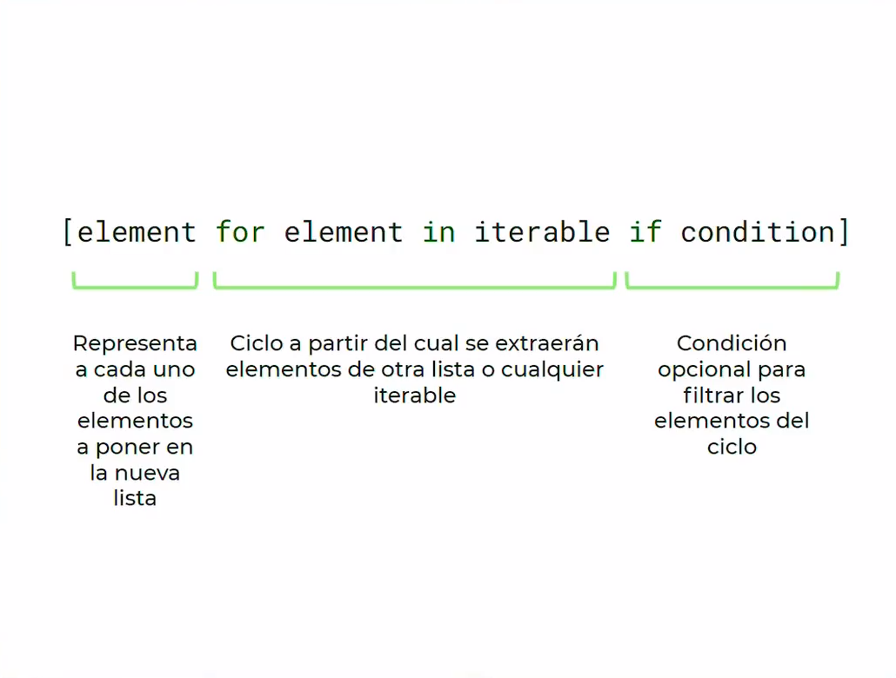

=================
Python Intermedio
=================

.. image:: ../../../_static/img/languages/python/logo.png
    :width: 400px
    :alt: Logo
    :align: center

.. |date| date::
.. |time| date:: %H:%M

Última edición el día |date| a las |time|.

.. contents:: Table de contenidos de la pagina
   :depth: 2
   :local:

El zen de python
################

* Bello es mejor que feo 
* Explicito es mejor que implícito (para que otro entienda)
* Simple es mejor que complejo (pocas lineas que resuelve)
* Complejo es mejor que complicado (extenderlo si es necesario)
* Plano es mejor que anidado (cuando hacemos muchas dependencias, código a la derecha)
* Espacio es mejor que denso (Identación obligatoria para mantener el orden 4 espacios)
* Legibilidad es importante (otros desarrolladores puedan leer el código)
* Los casos especiales no son lo suficientemente especiales como para romper las reglas.Sin embargo la practicidad le gana a la pureza.  (equilibrio entre pragmatismo y pythonismo)
* Los errores nunca deberían pasar silenciosamente. A menos que se silencien explícitamente. (Manejarlos es prioritario y deben ser controlados)
* Frente a la ambigüedad, evitar la tentación de adivinar. (No algoritmos ambiguos, única interpretación)
* Debería haber una, y preferiblemente solo una, manera obvia de hacerlo. A pesar de que esa manera no sea obvia a menos que seas holandés.
*  Ahora es mejor que nunca. A pesar de que nunca es muchas veces mejor que *ahora* mismo. (Hacerlo cuanto antes y no dejar para mañana, Si tenemos poco tiempo y desarrollamos mal código lo dejamos para después)
* Si la implementación es difícil de explicar, es una mala idea. Si la implementación es fácil de explicar, puede que sea una buena idea
* Los espacios de nombres son una gran idea, tengamos mas de esos

La documentación
#################

`Documentación de Python <https://docs.python.org/3/>`_  

PEP
*****

Documentos de guiá de estilo. El mas utilizado y las buenas practicas están en `PEP8 <https://peps.python.org/pep-0008/>`_ 

Que es un modulo?
#################

Es código escrito por otra persona, que nos sirve para resolver un problema de manera rápida
No reinventar la rueda, no realizar la solución que alguien mas hizo.
Ej: Random (números aleatorios)

Entorno virtual
###############

Un **entorno virtual** es como tener un entorno de instalación de python independiente por cada proyecto que tengamos y que tienen sus módulos independientes.
Poder probar diferentes proyectos con módulos con versiones diferente. 

Para crear el entorno virtual utilizamos el comando:

.. code-block:: console

    python -m venv venv

Para activar el entorno virtual utilizamos el comando:

* windows (CMD/Powershell)

.. code-block:: console
    
    .\venv\Scripts\activate

* macOs y Linux

.. code-block:: console

    source venv/bin/activate

Para salir del entorno virtual utilizamos el comando 

.. code-block:: console

    deactivate

.. note::
    Poner la carpeta venv del entorno virtual en el .gitignore

PIP
#####

Hay muchos módulos que están en python en su instalación de fabrica. Hay cierto módulos que fueron creados por 3ros y para instalar estos módulos usamos un gestor de dependencias o instalador de paquetes el mas popular en python es **pip** " ``package installer for python`` ".

Módulos populares
******************

Algunos módulos comunes:

* Requests
* BeautifulSoup4
* Pandas
* Numpy
* Pytest

Para listar los módulos utilizamos el comando 

.. code-block:: console

    pip freeze

Para instalar un modulo utilizamos el comando 

.. code-block:: console

    pip install pandas

Para poder compartir un proyecto e indicar las dependencias del mismo necesitamos pasar las dependencias de nuestro entorno virtual a un archivo, esto lo hacemos con el siguiente comando:

.. code-block:: console

    pip freeze > requirements.txt

Para instalar las dependencias desde un archivo utilizamos el comando

.. code-block:: console

   pip install -r requirements.txt

Listas y diccionarios anidados
##############################

.. code-block:: python

    super_list = [
        {"firstname": "Facundo", "lastname": "García"},
        {"firstname": "Miguel", "lastname": "Torres"},
        {"firstname": "Pepe", "lastname": "Rodelo"},
        {"firstname": "Susana", "lastname": "Martinez"},
        {"firstname": "José", "lastname": "García"},
    ]

    super_dict = {
        "natural_nums": [1, 2, 3, 4, 5],
        "integer_nums": [-1, -2, 0, 1, 2],
        "floating_nums": [1.1, 4.5, 6.43]
    }

    for key, value in super_dict.items():
        print(key, "-", value)

    print(" ")
    
    for i in super_list:
        print(i)

List comprehensions
###################

.. note::
    * El **if** es completamente opcional
    * Se lee "Para cada elemento en el iterable, guardo el elemento en la lista, si se cumple la condición"

.. code-block:: python

    LIMIT = 100
    squares = [i**2 for i in range(1,LIMIT+1) if i %3 != 0 ]
    print(squares)

Dictionary comprehensions
#########################

.. note::
    * El **if** es completamente opcional
    * Se lee "Para cada elemento en el iterable, Coloco una llave y un valor, si se cumple la condición"

.. code-block:: python

    LIMIT = 100
    my_dict = { i: i**3 for i in range(1,LIMIT+1) if i % 3 != 0 }
    print(my_dict)

lambda functions
################

Funciones sin nombre, o funciones anónimas. Son funciones sin identificador. Tienen la siguiente estructura

.. note::
    * Puede tener los argumentos que necesitemos, pero solo una expresión (un linea de código)

.. code-block:: python

    palindrome = lambda string: string == string[::-1]
    print(palindrome)

Funciones de orden superior
###########################

Es una función que recibe como parámetro a otra función

Filter
******

Me permite filtrar elementos de un iterable

.. code-block:: python

    my_list = [1,4,5,6,9,13,19,21]
    odd = list(filter(lambda x: x%2 != 0, my_list))
    print(odd)

Map
*****

Me permite transformar los elementos de una lista 

.. code-block:: python

    my_list  = [1,2,3,4,5]
    squares = list(map(lambda x: x**2, my_list))

Reduce
******

Reduce los valores de la lista a un único valor

.. code-block:: python

    from functools import reduce

    my_list = [2, 2, 2, 2, 2]
    all_multiplied = reduce(lambda a,b: a*b, my_list)

Los errores en el código
#########################

Errores de Sintaxis
*******************

Cuando python nos avisa que escribimos mal una palabra clave. Python no ejecuta.

Exceptions
**********

Suceden en algún punto del programa que hace que quiebre la lógica. Python lo hace en una linea especifica y las lineas anteriores si se ejecutan.

Python **eleva** una excepción para cortar el proceso. Python crea un objeto de typo excepción y lo va moviendo en los bloques desde dentro hacia afuera. 

Las excepciones mas comunes son:

* **KeyboardInterrupt** : Cuando pulsamos ctrl + c en la consola de python. Cortamos el proceso de ejecución de python.
* **keyError** : Intentamos acceder a una llave en un diccionario y esta no existe.
* **IndexError** : Cuando intentamos acceder al indice en una lista que no existe. 
* **FileNoteFoundError** : Cuando intentamos abrir un archivo que no existe.
* **ZeroDivisionError** : Sucede cuando intentamos dividir un numero entre cero.
* **ImportError** : Intentamos importar un modulo y hay un error en este modulo.

TraceBack
=========

Es el mensaje de error que nos muestra python. Se lee desde la ultima linea hasta la primera.

.. image:: ../../../_static/img/languages/python/tracekback.png
    :width: 400px
    :alt: TraceBack
    :align: center

1. Vemos que tipo de excepción es y un pequeño resumen.
2. La line anterior: En que archivo ocurrió, la linea y que modulo (<stdin> consola interactiva)
3. La anterior anterior: La traza del error de donde parte. Si el error no es capturado python eleva el error a la función mas arriba.

Debugging
#########

1. Para hacer debugging en **vscode** con **python** tenemos que tener instalada la extension ``ms-python.python``
2. Luego vamos a la barra lateral izquierda y seleccionamos el botón run and debug
3. Y Presionar el botón Run and Debug
4. Podemos establecer los breakpoints en el código haciendo click a lado del numero de la linea
5. Podemos avanzar linea por linea entrar a una función, reiniciar la depuración, continuar o pararla.

Manejo de excepciones
#####################

try, except
***********

Por ejemplo cuando queremos ingresar números en una función que no los esperaba

.. code-block:: python

    def palindrome(string):
        return string == string[::-1]

    try:
        print(palindrome(1))
    except TypeError:
        print("Solo se pueden ingresar strings")

Atrapo la excepción ``TypeError`` e indico lo que sucede después de la excepción 

raise
*****

Puede ser que tengamos un error, pero python no lo detecta como tal, raise eleva el error. Ej: evitar que se ingresen cadenas vaciás. Raise eleva el error.

.. code-block:: python

    def palindrome(string):
        try:
            if len(string) == 0:
                raise ValueError("No se puede ingresar una cadena vacía")

            return string == string[::-1]
        except ValueError as ve:
            print(ve)
            return False

    try:
        print(palindrome(""))
    except TypeError:
        print("Solo se pueden ingresar strings")

Finally
*******

Se usa al final e try except para cerrar un archivo, conexión a BD o liberar recursos externos. (No se usa generalmente)

.. code-block:: python

    try:
        f = open("archivo.txt")
        # hacer cualquier cosa con nuestro archivo
    finally:
        f.close() #Si hay algún error o no se va a cerrar el archivo.

Assert statements
#################

Es una manera mas extravagante de manejar los errores. Son expresiones para manejar el flujo de nuestro programa.

.. note::
    Se lee "Afirmo que esta condición es verdadera si no, imprimo mensaje de error"

.. code-block:: python

    def palindrome(string):
        assert len(string) > 0, 'No se puede ingresar una cadena vaciá'
        return string == string[::-1]
    
    print(palindrome(""))

    # AssertionError: No se puede ingresar una cadena vaciá

Archivos
########

En python hay 3 modos de apertura de un archivo de texto

* R -> lectura
* W -> Escritura (sobrescribe)
* A -> Escritura (Agregar al final)

.. code-block:: python

    with open("./ruta/del/archiv.txt", "r") as f:

* **with:** es un manejador contextual. Controla el flujo de nuestro archivo.
* **open:** función interna para abrir el archivo. Con 2 parámetros, la ruta y el modo de apertura 
* **as:** para darle un nombre mas simple al archivo, en este caso es f.

.. code-block:: python

    #Función para leer un archivo
    def read():
        numbers = []
        with open('./archivos/numbers.txt', 'r', encoding="utf-8") as f:
            for line in f:
                numbers.append(int(line))
        print(numbers)

    #Función para escribir un archivo
    def write():
        names = ["Maria", "Fernanda"]
        with open('./archivos/names.txt', 'a', encoding="utf-8") as f:
            for name in names:
                f.write(name)
                f.write("\n")

