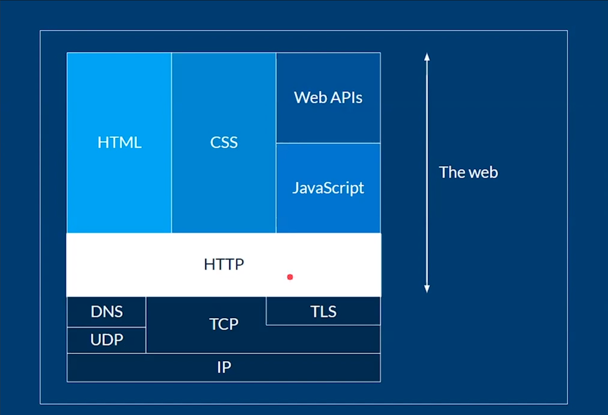

=======================
Web scraping con Python
=======================

.. |date| date::
.. |time| date:: %H:%M

Última edición el día |date| a las |time|.

.. contents:: Table de contenidos de la pagina
   :depth: 2
   :local:

¿Que es el web Scraping?
########################

**Web scraping:** Es una técnica usada por data scientist y backend developers para extraer información de internet, acceder a esto usando el protocolo de transferencias de hipertexto (HTTP) o a través de un navegador. Los datos extraídos usualmente son guardados en una base de datos, incluso en una hoja de cálculo para posteriores análisis. Puede hacerse de manera automática o manualmente.

**Xpath:** es un lenguaje que sirve para apuntar a las partes de un documento XML. Xpath modela un documento XML como un árbol de nodos. Existen diferentes tipos de nodos: elementos, atributos, texto.

¿Por que aprender Web Scraping?
###############################

* Para poder seguir el rastro de una persona o de un país (Agencias de inteligencia)
* Para hacer aplicaciones para comprar precios en diferentes paginas (Trivago)
* Utilizado por aplicaciones de e-commerce para comprar precios entre competencias (amazon, eBay, OLX, Mercado Libre) 
* Reclutadores de personal lo utilizan para comparar los perfiles y determinar los mas adecuados para un puesto de trabajo.
* En el marketing digital, para analizar los contenidos como tweets y determinar las palabras que se hacen virales o que llegan a Trending topic

¿Porque python para Web Scraping? 
#################################

Python es el lenguaje que mas soporte tiene en la comunidad y el open source para realidad este tipo de técnicas. Tiene muchos módulos que nos permiten realizar web scraping. Es el lenguaje mas especializado para hacer ciencia de datos.

Entre los multiples módulos de python para el web scraping están: 

* **Requests:** es una librería que nos permite controlar HTTP
* **BeautifulSoup:** Sirve para extraer información de un documento HTML

Existen frameworks avanzados como por ejemplo 
* **Selenium** con el cual podemos crear navegadores fantasma y podemos controlar sitios web de manera automática (bots).
* **Scrapy** Es el mas utilizado para hacer web scraping. Es usado por Reino unido para recolectar los datos de la población local.

HTTP
#####

HTTP: es un protocolo (conjunto de reglas) a partir del cual 2 computadoras se comunican en el internet. Estas computadoras poseen un nombre:

* Cliente: Realiza una petición (nuestra computadora)
* Servidor: Responde la petición realizada por el cliente (Google) 

Estructura de una petición HTTP
********************************

.. code-block:: 

    # Request

    GET / HTTP/1.1
    Host: developer.mozilla.org
    Accept-Language: en

    #Response

    HTTP/1.1 200 OK
    Date: Sat, 09 Oct 2010 14:28:02 GMT
    Server: Apache
    Last-MOdified: Tue, 01 DEC 2009 20:18:22 GMT
    ETag: "51142bc1-7449-479b075b2891b"
    Accept-Ranges: bytes
    Content-Length: 29769
    Content-type: text/html

    <!DOCTYPE html... (here comes the 29769 bytes of the requested web page)

Estructura de la web
********************

Debajo de HTTP tenemos los siguiente protocolos:

* **IP:** Internet Protocolo, a partir del cual salen las direcciones IPV4 e IPV6 que identifican de manera única a nuestra computadora en la red.
* **TCP:** Transmisión Control Protocol, que establece como se va a transferir información a bajo nivel.
* **UDP:** User Datagram Protocol, parecido a TCP.
* **TLS:** Transport Layer Security, relacionado con el encriptado de la información para que el atacante no pueda ver lo que se enviá.
* **DNS:** Domain Name System, resuelve nombre de dominio a una IP.

Por encima tenemos HTTP que nos permite transportar:

* **HTML:** Lenguaje de marcado de un sitio web. Información que vamos a usar para el web scraping.
* **:CSS:** Lenguaje de estilos para el sitio web.
* **Web APIs:** Interfaz de programación de aplicaciones.
* **JavaScript:** Para la interacción entre diferentes partes de una pagina.

Status codes mas comunes
************************

* Status code 200 – OK.
* Status code 301 – Moved Permanently.
* Status code 302 – Moved Temporarily.
* Status code 403 – Forbidden
* Status code 404 – Not Found
* Status code 500 – Internal Server Error
* Status code 503 ­– Service Unavailable

HTML
#####

**HTML:** Hypertext Markup Language, es un lenguaje que nos permite definir la estructura que va a tener una pagina web. Esto es de nuestro interés porque es aquí donde esta la información que queremos extraer, utilizando web scraping.

Robot.txt
#########

El archivo robots.txt es una forma de administrar una página web. Proporciona información a los rastreadores de los buscadores sobre las páginas o los archivos que pueden solicitar o no de tu sitio web. Principalmente, se utiliza para evitar que tu sitio web se sobrecargue con solicitudes. En el contexto de web scraping, le dice al scraper que puede y no extraer. Es decir hasta donde puede llegar. Ya que infringir en la violación de estas directivas puede acarrear un problema legal con el sitio web al que estamos scrapeando.

Contiene entre otros elementos:

**USER-AGENT:** Identificadores de quienes acceden a tu sitio web, puede ser un archivo.py hasta un googlebot.

DIRECTIVAS
**********

* **ALLOW:** Utiliza esta directiva para permitir a los motores de búsqueda rastrear un sub-directorio o una página, incluso en un directorio que de otro modo no estaría permitido.
* **DISALLOW:** Utiliza esta directiva para indicar a los motores de búsqueda que no accedan a archivos y páginas que se encuentren bajo una ruta específica.

.. code-block:: 

    url/robots.txt
    Pro ejemplo:

    # Robots.txt file from http://www.nasa.gov
    #
    # All robots will spider the domain

    User-agent: *
    Disallow: /worldbook/
    Disallow: /offices/oce/llis/

Para conocer más información de `robots.txt <https://ahrefs.com/blog/es/robots-txt/>`_.

XPath
#####

**XPath:** XML Path Language. XML (extensible markup language) es un lenguaje muy parecido a HTML. Sirvió para definir interfaz, es un lenguaje formado por nodos, es decir etiquetas. Como HTML es parecido a XML podemos hacer uso de esta técnica para extraer información de paginas web.

Tipos de nodos
**************

Un nodo es lo mismo que una etiqueta y su contenido. Un nodo puede contener a otros nodos. En otras palabras Xpath nos permitirá navegar en los diferentes niveles de profundidad deseados con el fin extraer información. Para describir los nodos y relaciones con Xpath se usan una sintaxis de ejes.

Expresiones
***********

Para escribir expresiones se usara lo siguiente en consola $x(''). Entre las comillas se van a escribir las expresiones, las expresiones tienen diferentes símbolos que tienen una utilidad.

Se describe la utilidad de cada expresión.

* ``/`` hace referencia a la raíz, o también significa un salto entre nodos. e.g /html/bodyMuestra todo lo que hay dentro del body de html
* ``//`` Sirve para acceder a todos los nodos con la etiqueta seleccionada. e.g [*//span](//span) muestra todas las etiquetas span*
* ``..`` Sirve para acceder a los nodos padre de la etiqueta tag. e.g //span/.. accede a todos los nodos padre de span
* ``.`` Hace referencia al nodo actual. e.g. //span/. es equivalent a //span
* ``@`` Sirve para traer los atributos. e.g //div/@class Nos da las clases de todos los divs

Predicados
**********

Para encontrar nuestra información debemos ser más específicos, para ello sirve los predicados. Se escriben entre corchetes []

Ejemplos de predicados:

* **n :** Hace referencia al n elemento de la lista EJ: 1, 2, 3. last(): Al último elemento de la lista.
* **@atribute_name :** Al usarse como predicado me trae todos los nodos que contienen este atributo.
* **@atribute_name="value" :** Al usarse como predicado me trae todos los nodos en el que el valor del atributo es value.
* **position() :** nos da la posición de una lista para hacer comparaciones

Operadores
**********

Hay una forma de filtrar más avanzada y es con operadores lógicos. Estos se utilizan dentro del predicado

* **=** - Igual
* **!=** - Distinto
* **>** - Mayor
* **<** - Menor
* **and** - and lógico
* **or** -  or lógico
* **not()** - negación. su argumento es el contenido del predicado 

Wildcards
*********

Son los comodines, los utilizamos cuando no sabemos el nodo que queremos traer, pero sabemos mas o menos el lugar donde buscar. 

Ejemplos:

* ``$x('/')`` <- Trae todo el documento porque representa la raíz de nuestro el html
* ``$x('/*')`` <- * después de / pide que traiga todos los nodos que están debajo de / (* es el primer wildcard)
* ``$x('/html/*')`` <- Trae todos los nodos que están inmediatamente después de html
* ``$x('//*')`` <- // es la expresión para saltar todos los niveles y con el * en todas las direcciones. Trae todos los nodos y todos los atributos de estos nodos.
* ``$x('//span[@class="text]/@*')`` <- Trae todos los span, que tengan como clase “text”, con @* trae todos los atributos. Dicho de otra forma, trae todos los atributos de todos los nodos de tipo span de clase “text”.
* ``$x('/html/body//div/@*')`` <- Todos los atributos (usando @*) de todos los div (usando //div) que están después de body
* ``$x('//span[@class="text" and @itemprop="text"]/node()')`` <- Trae todos los spam que sean de clase “text” que tengan un atributo @itemprop “text” y de ahí (usando node()) traer todo lo que esté dentro de los spam que cumplen las condiciones

.. note::
   node() a diferencia de * trae no solamente los nodos, sino también todo el contenido

In-text search
**************

Para buscar cadenas de caracteres especificas dentro de un texto.

* ``starts-with(.,"Texto a buscar"):`` Empezar con, el punto hace referencia al nodo actual.
* ``contains (., "Texto a buscar"):`` Sirve para llamar por el texto contenido en.
* ``ends-with(.,"Texto a buscar"):`` Terminar con, el punto hace referencia al nodo actual.
* ``matches(.,"Regex"):`` Que coincida la cierta expresión regular. 

.. note::
   Debido a las versiones del lenguaje Xpath en los navegadores las funciones end-with y matches no están disponibles, pero una ve en código python corren sin problemas.

XPath Axes
**********

**Azúcar sintáctica** : se refiere a los añadidos a la sintaxis de un lenguaje de programación diseñados para hacer algunas construcciones más fáciles de leer o expresar.

* **self::div** -> se abrevia con . y se refiere al mismo nodo o div en este caso
* **child::div** -> Trae los hijos del div
* **descendant::div** -> Trae todos los nodos que están en niveles inferiores
* **descendant-or-self::div** -> Trae la unión entre los descendientes y el mismo nodo div

Scraping con python
###################

.. code-block:: python

    import requests 
    import lxml.html as html
    import os
    import datetime

    HOME_URL = 'https://www.larepublica.co/'

    XPATH_LINK_TO_ARTICLE = '//text-fill/a/@href'
    XPATH_TITLE = '//div[@class="mb-auto"]/text-fill/span/text()'
    XPATH_SUMMARY = '//div[@class="lead"]/p/text()'
    XPATH_BODY = '//div[@class="html-content"]/p[not(@class)]/text()'

    def parse_notice(link, today):
        try:
            print(link)
            response = requests.get(link)
            if response.status_code == 200:
                notice = response.content.decode('utf-8')
                parsed = html.fromstring(notice)
                try:
                    title = parsed.xpath(XPATH_TITLE)[0]
                    title = title.replace('\"', '')
                    title = title.replace('?', '')
                    title = title.replace(':', '')
                    summary = parsed.xpath(XPATH_SUMMARY)[0]
                    body = parsed.xpath(XPATH_BODY)
                except IndexError:
                    return
                
                with open(f'{today}/{title}.txt', 'w', encoding='utf-8') as f:
                    f.write(title)
                    f.write('\n\n')
                    f.write(summary)
                    f.write('\n\n')
                    for p in body:
                        f.write(p)
                        f.write('\n\n')
            else:
                raise ValueError(f'Error: {response.status_code}')

        except ValueError as ve:
            print(ve)

    def parser_home():
        try:
            response = requests.get(HOME_URL)
            if response.status_code == 200:
                home = response.content.decode('utf-8')
                parsed = html.fromstring(home)
                links_to_notices = parsed.xpath(XPATH_LINK_TO_ARTICLE)
                # print(links_to_notices)

                today = datetime.date.today().strftime('%d-%m-%Y')
                if not os.path.isdir(today):
                    os.mkdir(today)

                for link in links_to_notices:
                    parse_notice(link, today)

            else:
                raise ValueError(f'Error: {response.status_code}')
        except ValueError as ve:
            print(ve)

    def run():
        parser_home()

    if __name__ == '__main__':
        run()